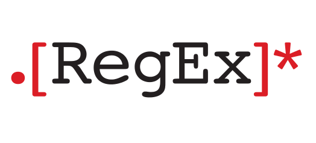

# Simple Regex

A library built to automate the most commonly used regular expressions.

Well I've got this issue with regular expressions and it's that I suck at writing them (well this is because I never really gave time to master them). When faced with problems that are meant for regular expressions, I just find other ways of solving them or a quick google search for a solution.

So I just decided to write a library that automates the most common usage of regular expressions in Python like extracting and validating emails, phone numbers and all the basic stuffs...

Contribute to the project with codes and/or suggestions for more functionality
